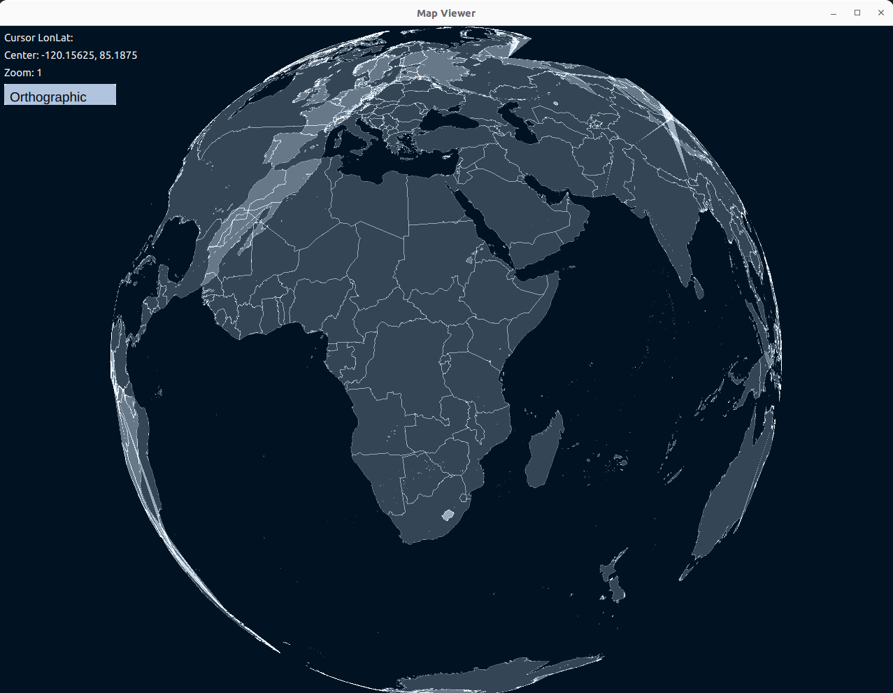
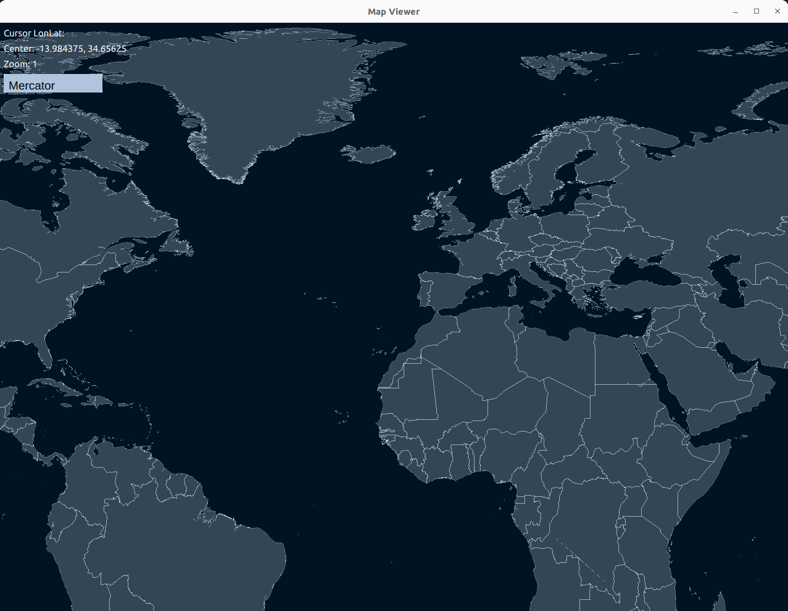
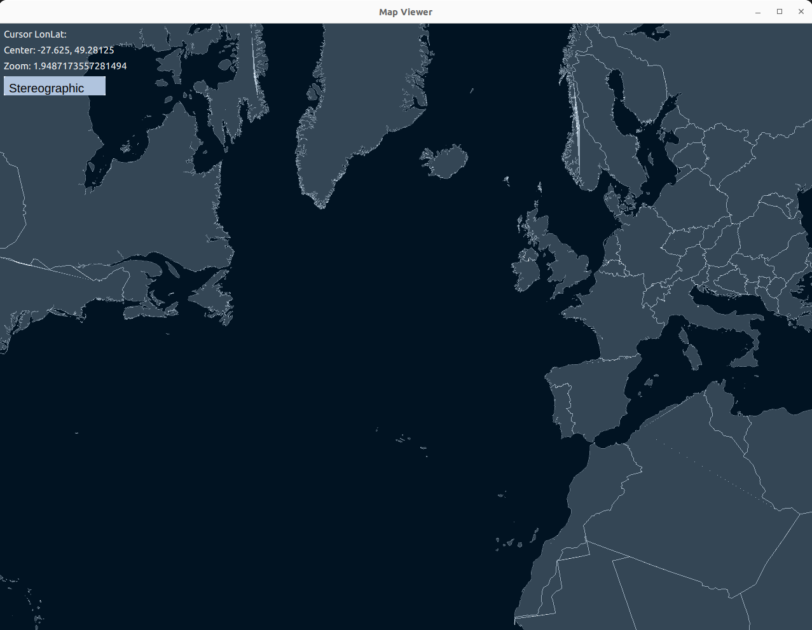

# QtMapRenderer

C++ application that uses OpenGL to render a map of the world.

Qt6 for the window and OpenGL context. And QML for the UI.

glm for matrix calculations and GeoJSON for map data.

Earcut from mapbox is used for triangulation of the map data.

Vertex shader implements the map projections, supported projections are 

- Mercator
- Orthographic
- Stereographic

Contact 

olafurjohannss@gmail.com